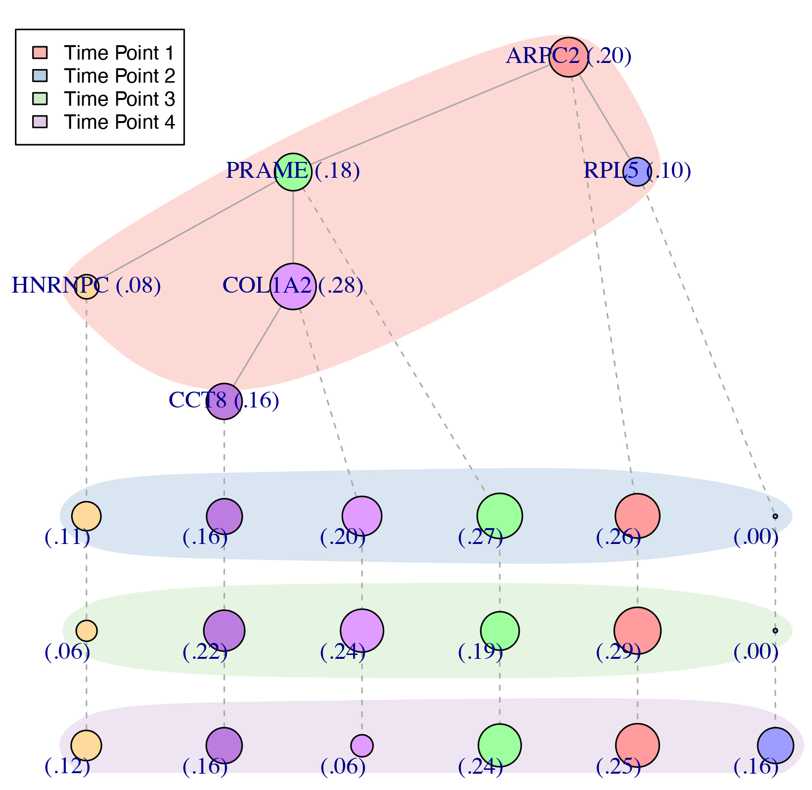

# Longitudinal Analysis of Cancer Evolution (LACE)
================

| Branch              | Stato CI      |
|---------------------|---------------|
| master | [](https://travis-ci.org/BIMIB-DISCo/LACE) |
| development | [](https://travis-ci.org/BIMIB-DISCo/LACE) |

================

**OVERVIEW**

In this repository we provide an R implementation of *LACE*. 

*LACE* is an algorithmic framework that processes single-cell somatic mutation profiles from cancer samples collected at different 
time points and in distinct experimental settings, to produce longitudinal models of cancer evolution. The approach solves a Boolean Matrix 
Factorization problem with phylogenetic constraints, by maximizing a weighted likelihood function computed on multiple time points. 

**INSTALLING LACE R IMPLEMENTATION**

The R version of *LACE* can be installed from Github. To do so, we need to install the R packages *LACE* depends on and the devtools package. 

First we run an R session and we execute the following commands. 

```r
# run this commands only if the following R packages are not already installed
install.packages("devtools", dependencies = TRUE)
install.packages("igraph", dependencies = TRUE)
install.packages("RColorBrewer", dependencies = TRUE)
install.packages("Rfast", dependencies = TRUE)
```

Now we can install and run *LACE* as follows: 

```r
# install CIMLR from Github
library("devtools")
install_github("BIMIB-DISCo/LACE", ref = "master")

# load LACE library
library("LACE")
```

**RUNNING LACE R IMPLEMENTATION**

We now present an example of longitudinal analysis of cancer evolution with *LACE* using single-cell data obtained from Rambow, Florian, et al. "Toward minimal residual disease-directed therapy in melanoma." Cell 174.4 (2018): 843-855. 

As a first step, we load single-cell data for a skin melanoma. The data comprises point mutations for four 
time points: (1) before treatment, (2) 4 days treatment, (3) 28 days treatment and finally (4) 57 days treatment. 

```r
library("LACE")
data(data)
names(data)

## [1] "T1_before_treatment"  "T2_4_days_treatment"  "T3_28_days_treatment" "T4_57_days_treatment"
```

We setup the main parameter in oder to perform the inference. First of all, as the four data points may potentially provide sequencing for an unbalanced 
number of cells, we weight each time point proportionally to the sample sizes as follow. We refer to the paper for details. 

```r
lik_weights = c(0.2308772,0.2554386,0.2701754,0.2435088)
```

The second main parameter to be defined as input is represented by the false positive and false negative error rates, i.e., alpha and beta. We can specify a 
different rate per time point as a list of rates. When multiple set of rates are provided, *LACE* performs a grid search in order to estimate the best set of error rates. 

```r
alpha = list()
alpha[[1]] = c(0.02,0.01,0.01,0.01)
alpha[[2]] = c(0.10,0.05,0.05,0.05)
beta = list()
beta[[1]] = c(0.10,0.05,0.05,0.05)
beta[[2]] = c(0.10,0.05,0.05,0.05)
head(alpha)

## [[1]]
## [1] 0.02 0.01 0.01 0.01
##
## [[2]]
## [1] 0.10 0.05 0.05 0.05

head(beta)

## [[1]]
## [1] 0.10 0.05 0.05 0.05
##
## [[2]]
## [1] 0.10 0.05 0.05 0.05
```

We can now perform the inference as follow. 

```r
inference = LACE(D = data, 
    lik_w = lik_weights, 
    alpha = alpha, 
    beta = beta, 
    keep_equivalent = FALSE, 
    num_rs = 5, 
    num_iter = 10, 
    n_try_bs = 5, 
    num_processes = NA, 
    seed = 12345, 
    verbose = FALSE)
```

We notice that the inference resulting on the command above should be considered only as an example; the parameters num_rs, num_iter and n_try_bs representing the number of 
steps perfomed during the inference are downscaled to reduce execution time. We refer to the Manual for discussion on default values. We provide within the package results 
of inferences performed with correct parameters as RData. 

```r
data(inference)
print(names(inference))

## [1] "B" "C" "corrected_genotypes"
## [4] "clones_prevalence" "relative_likelihoods" "joint_likelihood"
## [7] "clones_summary" "equivalent_solutions" "error_rates"
```

*LACE* returns a list of nine elements as results. Namely, B and C provide respectively the maximum likelihood longitudinal tree and cells attachments; corrected_genotypes the corrected genotypes, clones_prevalence, the estimated prevalence of any observed clone; relative_likelihoods and joint_likelihood the estimated likelihoods for each time point and the weighted likelihood; clones_summary provide a summary of association of mutations to clones. In equivalent_solutions, solutions (B and C) with likelihood equivalent to the best solution are returned; notice that in the example we disabled this feature by 
setting equivalent_solutions parameter to FALSE. Finally, error rates provide the best error rates (alpha and beta) as estimated by the grid search. 

We can plot the inferred model using the function longitudinal.tree.plot. 

```r
clone_labels = c("ARPC2","PRAME","HNRNPC","COL1A2","RPL5","CCT8")
longitudinal.tree.plot(inference = inference,
                       labels = "clones", 
                       clone_labels = clone_labels, 
                       legend_position = "topleft")
```



**DEBUG**

Please feel free to contact us if you have problems running our tool at daniele.ramazzotti1@gmail.com or d.maspero@campus.unimib.it. 
