```{r, include = FALSE}
knitr::opts_chunk$set(
  collapse = TRUE,
  comment = "#>",
  echo = TRUE, 
  eval = FALSE
)
```

LACE 2.0 is a new release of the LACE R package.
LACE 2.0 is capable of performing clonal evolution analyses for single-cell sequencing data including longitudinal experiments.
LACE 2.0 allows to annotate variants and retrieve the relevant mutations interactively based on user-defined filtering criteria; it infers the maximum likelihood clonal tree, cell matrix attachments and false positive/negative rates using boolean matrix factorization.
Furthermore, LACE 2.0 allows to investigate cancer clonal evolution under different experimental conditions and the occurrence of single mutations which can be queried via *ensembl* database.

## Installation of LACE 2.0 R package

The package is available on GitHub and Bioconductor.
LACE 2.0 requires R \> 4.1.0 and Bioconductor.
To install Bioconductor run:

```{r}
if (!require("BiocManager", quietly = TRUE))
    install.packages("BiocManager")
```

To install LACE 2.0 run:

```{r}
remotes::install_github("https://github.com/BIMIB-DISCo/LACE", dependencies = TRUE)
```

LACE 2.0 uses *Annovar* and *Samtools suite* as back-ends for variant calling annotation and depth computation, respectively.
Please refer to the next section to install them.

## Installation of other required softwares

*Annovar* is a widely used variant calling software freely available upon registration to their website at <https://annovar.openbioinformatics.org/en/latest/>.
The package contains *Perl* scripts and variant calling annotation reference databases for the human species.
For other databases, please refer to their website.
If the scripts are installed in binary search path, then LACE 2.0 will detect them automatically.

*Perl* (<https://www.perl.org/>) is required to run *Annovar*.

*Samtools suite* is a standard set of tools and libraries to handle SAM/BAM/BED file format and perform a variety of common operations on sequencing data.
It is freely available at <http://www.htslib.org/> and <https://github.com/samtools/htslib>.
To install *Samtools* follow the instructions in their website.

#### For *Windows* users, we suggest the following guidelines:

-   Download *MSYS2* or *WSL*

-   Download the *Samtools* source files from <http://www.htslib.org/>

-   The field `db_home`, in the *Samtools* source file `etc/nsswitch.conf`, should be changed to `windows` such that: `db_home: windows`

-   Install *MSYS2*/*WSL* (it is preferably to have *MSYS2* in the "C:" path), and install the packages required by Samtools as stated in the INSTALL documentation file within the Samtool source folder

-   Inside a *MSYS2*/*WSL* shell, add the following directories to the variable PATH using the command: `export PATH="/mingw64/bin/:/mingw64/:$PATH"`

-   From the above *MSYS2*/*WSL* shell, follow the Samtools documentation to build and install the software

-   Change the Windows `PATH` variable in the System variables and add the following paths: `C:\msys64\usr\bin`, `C:\msys64\usr`, `C:\msys64\mingw64\bin`, `C:\msys64\mingw64`

-   We remind that *Annovar* is a *Perl* script, and `.pl` files need be associated to *Perl* executable.\
    Eventually, from the *Windows* command prompt, users should be able to start *Samtools* using the command `samtools` and directly execute *Perl* scripts by calling their filenames.

## Running LACE 2.0

To start LACE 2.0 user interface run:

```{r}
library(LACE)
LACEview()
```

## Using LACE 2.0

LACE 2.0 has been thought to be used on single cell sequencing data for which it is available variant calling data in standard VCF format and binary aligned data in standard BAM format.

The user is provided with an interface to initiate a project and to set filter thresholds after which annotation of variants, filtering of data and depth at variant sites are retrieved.
Both annotation and depth derivation are computationally expensive steps.
LACE 2.0 reduces possible re-computation by detecting parameter variations of the user interface and by comparison of the timestamps of interface state, inputs and outputs.
Intermediary and final data are stored in the designated folders.

The operation is followed by the possibility for the user to select variants which are drivers of the understudied biological problem.

At this point, the inferential step is executed so that the most likelihood longitudinal clonal tree and clonal prevalences are retrieved together with the best set of false positive/negative rates among those provided by the user.

The results are displayed via an interactive interface.

## Interface

The interface is divided in two parts interleaved by variant selection and inferential computation parts: the processing interface and the results interface.

### Project creation

To begin the clonal analyses the user needs to create a project by choosing a folder and a meaningful name for the project.

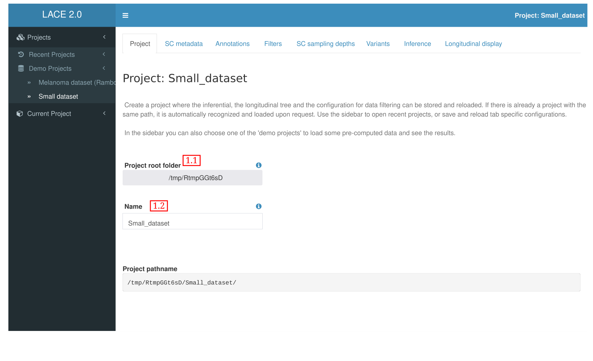{width="95%"}

If the project path does not contain former LACE projects, it asks the user to create a new one ("Create project") and all intermediate and final results will be stored in structured sub-folders of the chosen project path.

LACE 2.0 automatically recognizes if the selected path is a LACE project and proposes the user to load it ({width="10%"})

### Sidebar and Demos

The sidebar is divided in Projects and Current Project.
Projects contain a set of recently opened projects which can be reloaded by selecting the respective project name.

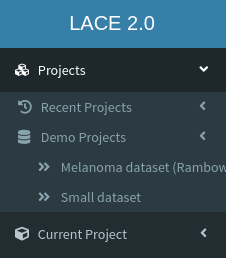{width="30%"}

Under Projects, there is the sub-menu Demos.
LACE 2.0 provides the user with two demos:

-   Melanoma dataset [Rambow, Florian, et al. "Toward minimal residual disease-directed therapy in melanoma." Cell 174.4 (2018): 843-855.] containing single cell variant annotations and depths for a total of 674 cells sampled at 4 different time points:
    1.  sample before treatment
        -   BRAF inhibitor treatment
    2.  sample after 4 days
    3.  sample after 28 days
    4.  sample after 57 days
-   Small dataset containing only 3 cells per 4 sampling time points.

Current Project allows the user to save and load the parameters of the whole project or of the active tab.

### Processing interface

#### Single Cell Metadata

In order to perform clonal analyses it is required to provide some information about the experiment such as the cell IDs which are used to retrieve the VCF/BAM files and the sample name each cell belongs to.
These metadata are generally included with the experimental sequencing data as part of the library preparation.
LACE 2.0 accepts tsv/csv tabular formats with headers and rds standard data R format.
Metadata file can include more information relative to the experimental setup and the platform used.

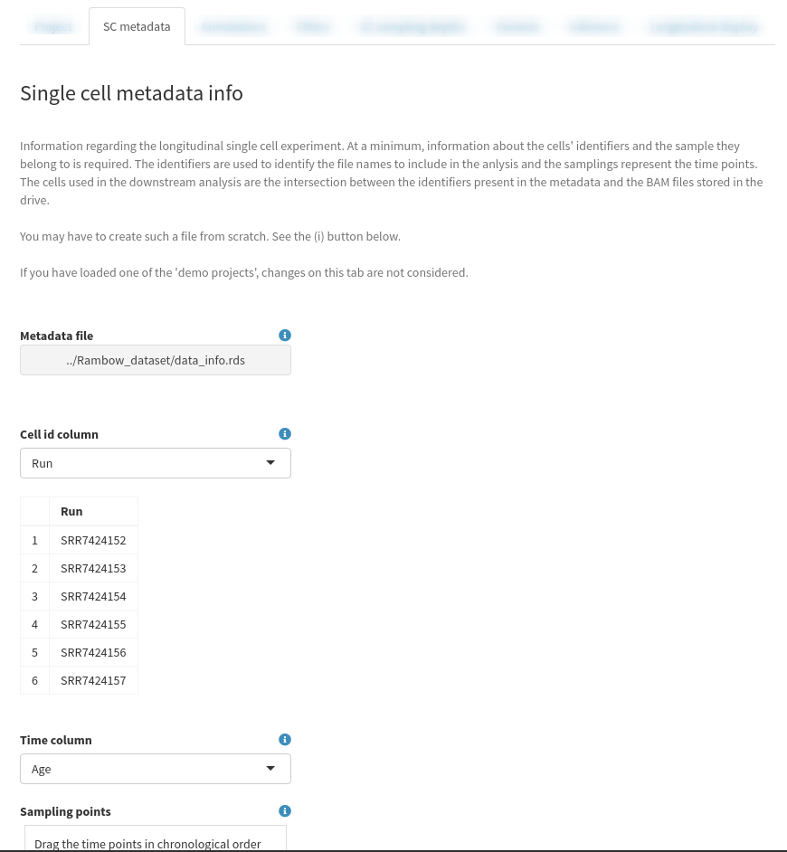{width="95%"}

The user should identify and select the ID and sampling columns.
The user can also reorder the sampling names

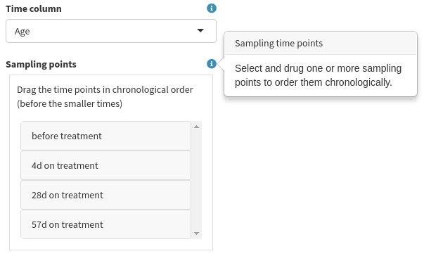{width="60%"}

so to recreate the chronological order of longitudinal events of the experiment, or to explore different orders.

#### Annotations

Annotations of variant calling data is performed using *Annovar* as back-end.
Each mutation of each cell is annotated based on the annotation database used.
*Annovar* provides a database for the human species useful to tag cancer mutations and whenever possible their functional effect.

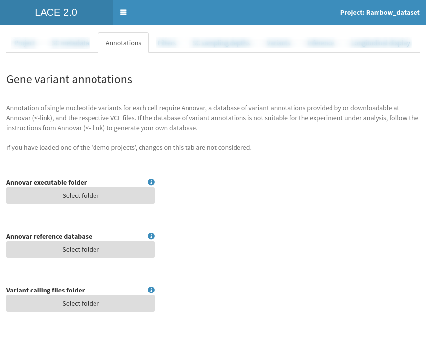{width="95%"}

If *Annovar*'s *Perl* scripts are available in the standard binary paths, they are detected and the *Annovar* folder field is autocompleted; otherwise, the user should provide the folder containing the *Perl* scripts.
The user should also provide the database to use for the annotation and the folder containing the variant calling files (VCF).

#### Variant filtering

All types of single cell sequencing data is characterized by various sources of noise which depends on the technology used.
Detected mutation might be characterized by low quality score or low statistical power.
Some mutations can be neglected, while others might cause relevant effects, especially on exonic regions where variations can result in changes of the translational process and modify their functional form.

In order to avoid small and possibly spurious fluctuations on sequencing data, variants can be filtered if they have low supporting evidences.
The user can set the minimum values for:

1.  the number of reads supporting the alternative alleles in a cell,
2.  the frequency of the minor allele for each referenced SNP included in a default global population,
3.  the cell frequency per sample showing the mutation at the same site.

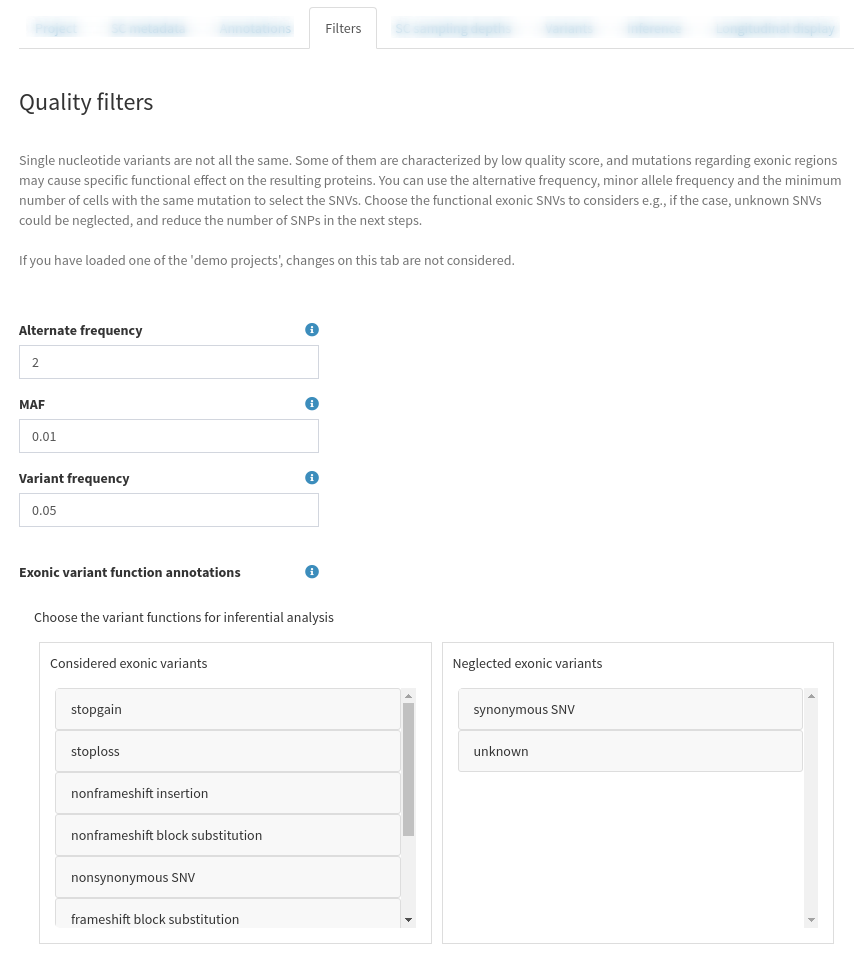{width="95%"}

Furthermore, the user can choose which functional exonic variation should be considered or neglected.
For example, there are cases in which unknown and synonymous mutations in exonic regions are disregarded because their effect cannot be explicitly related to the experimental condition.
All possible variant functions and their explanations are resumed in the following table:

| Annotation (+)                   | Explanation                                                                                                                                                                                                                                                                                         |
|----------------------|--------------------------------------------------|
| frameshift insertion             | an insertion of one or more nucleotides that cause frameshift changes in protein coding sequence                                                                                                                                                                                                    |
| frameshift deletion              | a deletion of one or more nucleotides that cause frameshift changes in protein coding sequence                                                                                                                                                                                                      |
| frameshift block substitution    | a block substitution of one or more nucleotides that cause frameshift changes in protein coding sequence                                                                                                                                                                                            |
| stopgain                         | a nonsynonymous SNV, frameshift insertion/deletion, nonframeshift insertion/deletion or block substitution that lead to the immediate creation of stop codon at the variant site. For frameshift mutations, the creation of stop codon downstream of the variant will not be counted as "stopgain"! |
| stoploss                         | a nonsynonymous SNV, frameshift insertion/deletion, nonframeshift insertion/deletion or block substitution that lead to the immediate elimination of stop codon at the variant site                                                                                                                 |
| nonframeshift insertion          | an insertion of 3 or multiples of 3 nucleotides that do not cause frameshift changes in protein coding sequence                                                                                                                                                                                     |
| nonframeshift deletion           | a deletion of 3 or mutliples of 3 nucleotides that do not cause frameshift changes in protein coding sequence                                                                                                                                                                                       |
| nonframeshift block substitution | a block substitution of one or more nucleotides that do not cause frameshift changes in protein coding sequence                                                                                                                                                                                     |
| nonsynonymous SNV                | a single nucleotide change that cause an amino acid change                                                                                                                                                                                                                                          |
| synonymous SNV                   | a single nucleotide change that does not cause an amino acid change                                                                                                                                                                                                                                 |
| unknown                          | unknown function (due to various errors in the gene structure definition in the database file)                                                                                                                                                                                                      |

(+) see *Annovar*

#### Single cell sampling depth

The number of reads per SNV site represents an optimal filter to retrieve relevant mutations.
Depth at specific sites is usually not provided in standard alignment or variant calling pipelines and it is computationally expensive to retrieve.
The user should provide the folder with aligned data and, if not found already, the *samtools* executable folder location to compute depth only on sites passing the variant filters set in the previous tab.

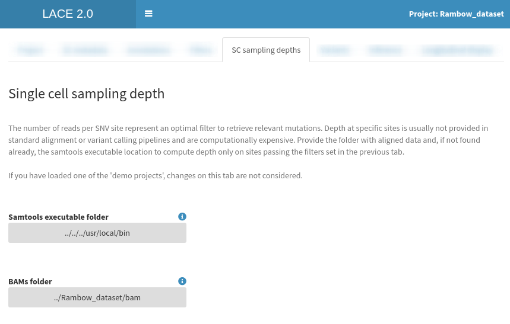{width="95%"}

### Selection of relevant variants

Not all mutations are distinctive of the disease or experiment understudied.
Identifying relevant and driver variants allows to reproduce a more significant longitudinal clonal tree.
The user can select a set of filters based on gold standards and other analyses such as:

1.  the minimum number of reads at given mutation site
2.  the maximum number of missing data per gene
3.  the minimum median depth per locus
4.  the minimum median depth supporting the mutation
5.  subset of known genes

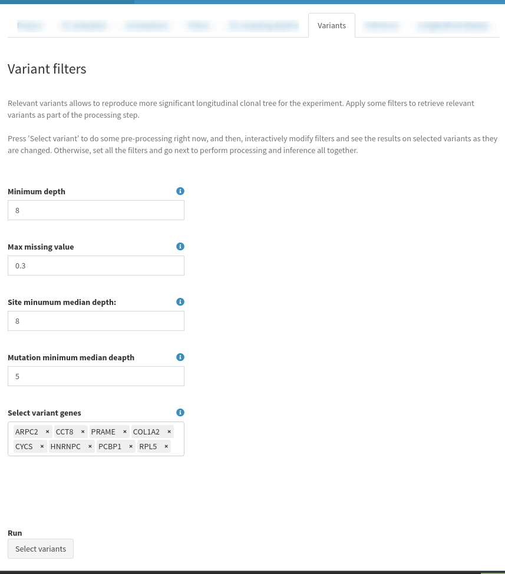{width="95%"}

Finding the parameters to select variants is not an easy task, and the user might not know in advance how to choose the best set of filters.
Hence, the user can press "Select variants" ({width="10%"}) to perform the aforementioned computations on VCF and BAM files to derive all the necessary aggregated information on the sampled cells.
Afterward, the user is presented with a interactive live preview of variants passing the filters (including relevant parameters which can help in the selection) while values are changed.

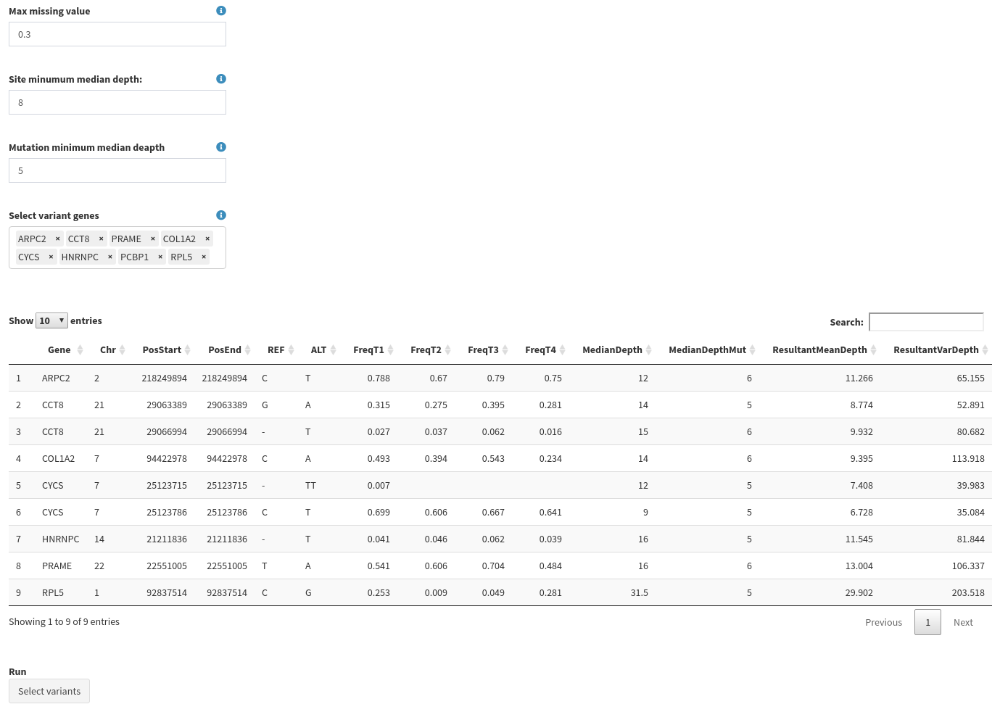{width="95%"}

### Inference

The inferential tab allows the user to set all the parameters to solve the boolean matrix factorization problem and estimate the model parameters of the Bayesian model using a MCMC to maximize the likelihood.

Inferential step uses the following set of parameters:

1.  Learning rate
2.  False positive rates for each sample
3.  False negative rates for each sample
4.  Number of iterations in each MCMC search
5.  Number of restart for the MCMC 5 Early stopping number of iterations with no growing likelihood\
6.  Number of parallel processes
7.  Random seed to recreate simulations
8.  Initialize the clonal tree randomly
9.  Marginalize the cell attachment matrix
10. Keep equivalent solutions and return all of them
11. Check indistinguishable event and remove them
12. Estimate error rates of MCMC moves
13. Show results

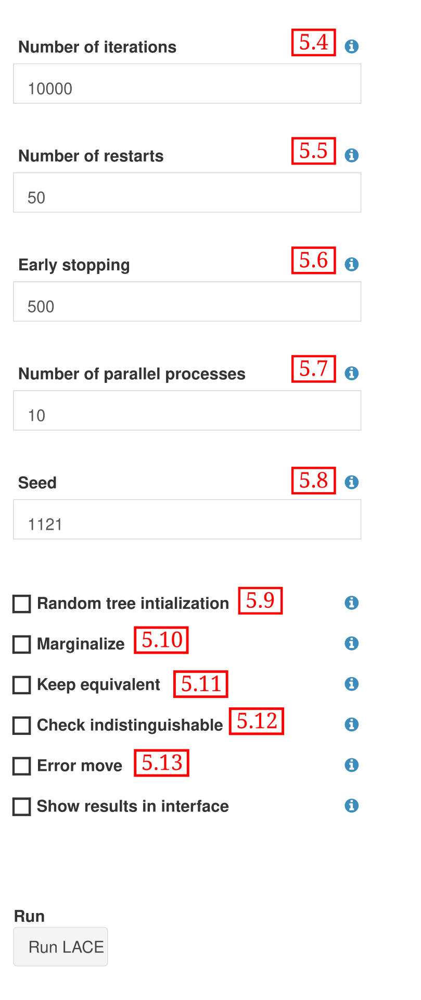{width="60%"}

The user must insert at least one false positive rate and one false negative rate value for each sample.
By double clicking on any cell belonging to the row "add row", the user can insert a new set of false or positive rates for each sample.
During the inferential step, the maximization of the likelihood for each set of rates is performed.
The best results are returned.

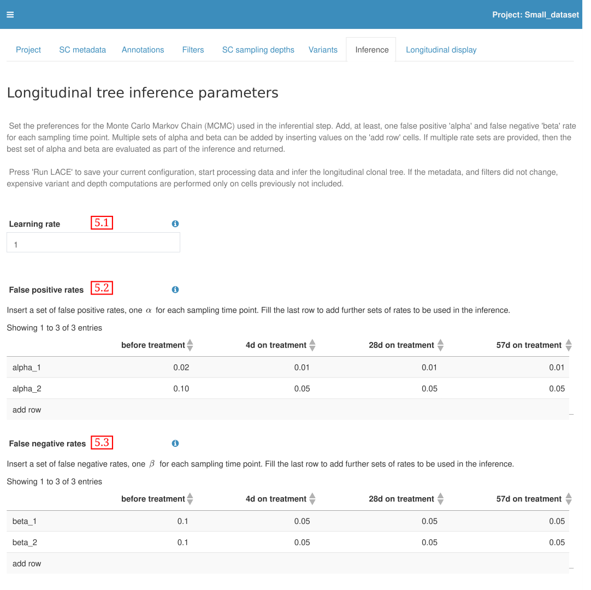{width="95%"}

Press "Run LACE" to perform all computation and estimation steps and visualize the results.

### Longitudinal display and outputs interface

The longitudinal display tab shows the longitudinal clonal tree, the fishplot and the clonal tree, together with the best false positive and negative rate parameters.

The longitudinal clonal tree is placed on the top left side.
Continuous edges are used to represent parental relations between clones, while dashed edges show persistence relations.
The size of the nodes is proportional to the clonal prevalence.
Moving the mouse over a node, it is possible to see the clonal prevalence value.
While moving the mouse over the mutation labels, it shows the complete set of mutations for that clone under the longitudinal clonal tree.

The fishplot is on the top right side of the tab.
Passing the mouse over the ribbons, the clonal prevalences of the clones at different time points are displayed.
Similarly, with the mouse over the time tags, the clonal prevalences of all clones at the specified time point are visualized.

By clicking on a mutation label of the longitudinal clonal tree as well as on a fishplot ribbon or a clonal tree node, the details of the mutation characterizing the clone can be queried and retrieved from the *Ensembl* database.

The bottom part of the tab is used to display the tree legend and the best estimated set false positive/negative rates.

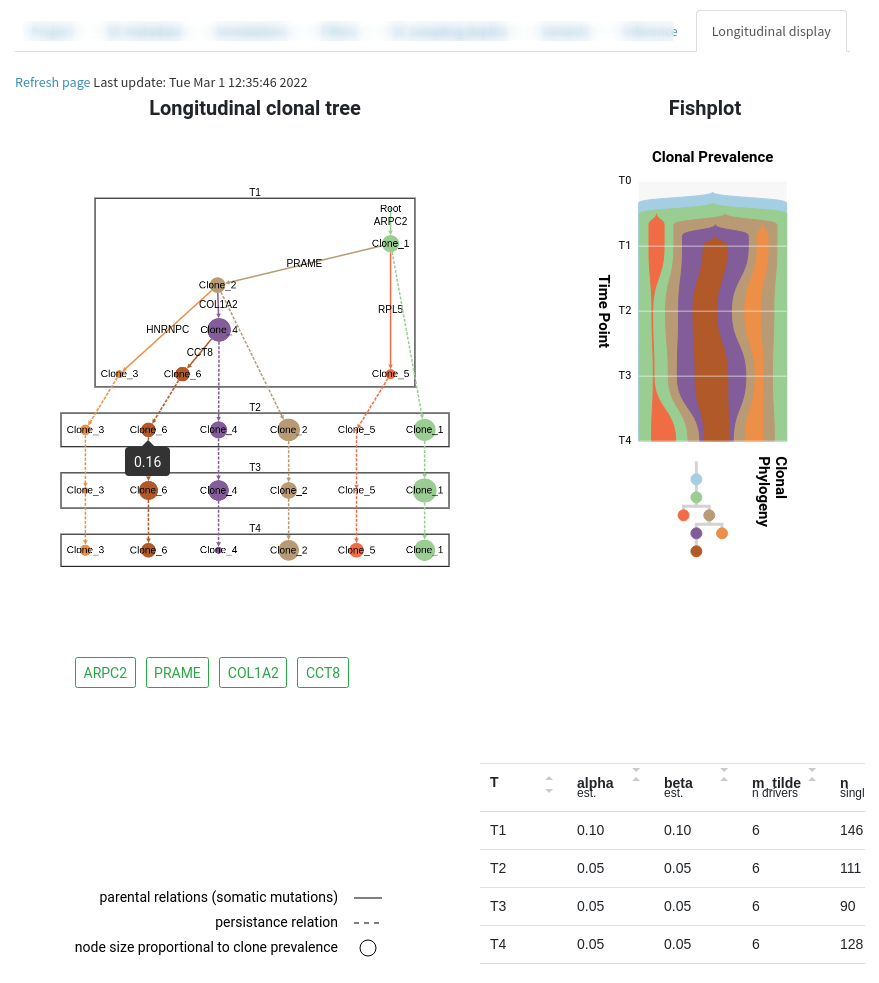{width="95%"}
